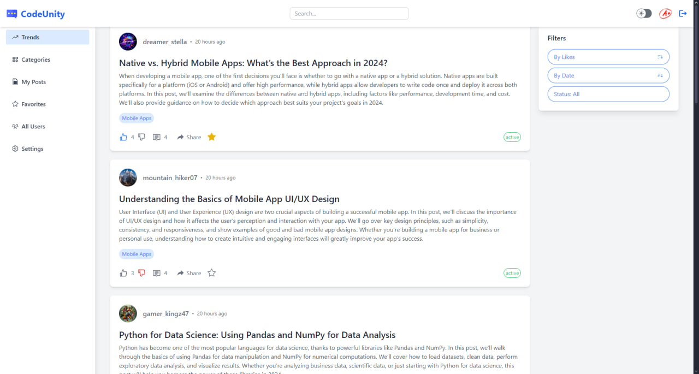

  
  <h1 align="center">CodeUnity</h1>

    <em>CodeUnity is a fully functional Reddit-like application built with Express.js, TypeScript, MySQL, Sequelize, React, Vite, Tailwind CSS and TypeScript. The app offers an engaging platform for users to interact with posts, comments, and replies, while administrators have advanced management features.</em>

	
	
	
	

		<em>Developed with the software and tools below.</em>

	
	
  
  
  
	
	
  
	
	

---

## 🖼️ Preview

  

---

## 📍 Features

### User Functionality:

- 👀 Browse trending posts and filter by likes, date, or status.
- 👍 Like/dislike posts, comments, and replies.
- ✏️ View, create, edit, and delete comments and replies.
- 📂 Explore all categories and posts within specific categories.
- ⭐ Add posts to favorites and view the favorites list.
- 👥 View user profiles and rankings.
- 📝 Create, edit, and delete personal posts with image support.
- ⚙️ Manage personal account settings: update username, full name, and password, or delete the account.

### Admin Functionality:

- 👨‍💻 Create, edit, and delete categories.
- 🏷️ Manage user roles or delete users.

---

## 🚀 Getting Started

To get started with CodeUnity, follow the installation instructions for both the client and server. Click on the links below for detailed guides:

- [Client Setup](https://github.com/lerobait/UCODE-Usof/tree/main/client) - Instructions for setting up the client application.
- [Server Setup](https://github.com/lerobait/UCODE-Usof/tree/main/server) - Instructions for setting up the server application.

---

## 📜 License

This project is licensed under the [MIT License](https://github.com/lerobait/UCODE-Usof/blob/main/LICENSE). Feel free to use, modify, and distribute it as permitted under the license terms.
